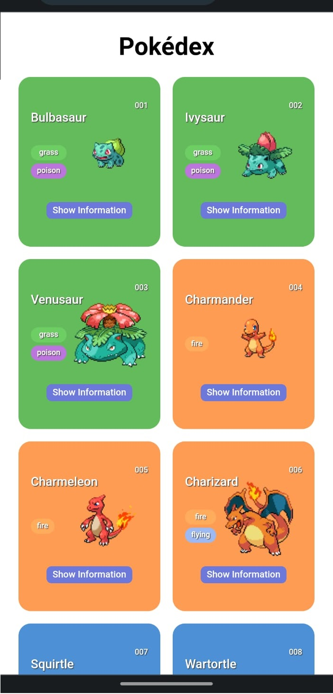
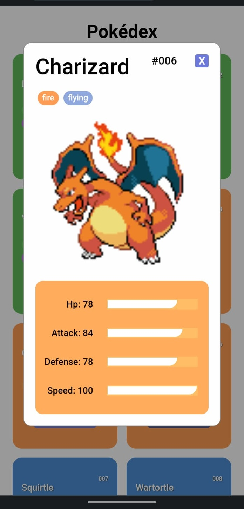

<h1 align="center">  POKÉDEX </h1>

Este é um projeto que foi desenvolvido como parte do Santander Bootcamp 2023 - Fullstack Java+Angular, nas matérias introdutórias de JavaScript, HTML e CSS. O objetivo deste projeto foi de criar uma página que mostre a primeira geração de Pokémon, utilizando a <a href="https://pokeapi.co">PokéAPI</a>. A parte principal do site foi desenvolvida em sincronia com o professor enquanto a tela de detalhe do Pokémon foi pensada posteriormente por mim.

 

    
    
Visualização do projeto para desktop

<!-- 

    
    
    
Visualização do projeto mobile

 -->